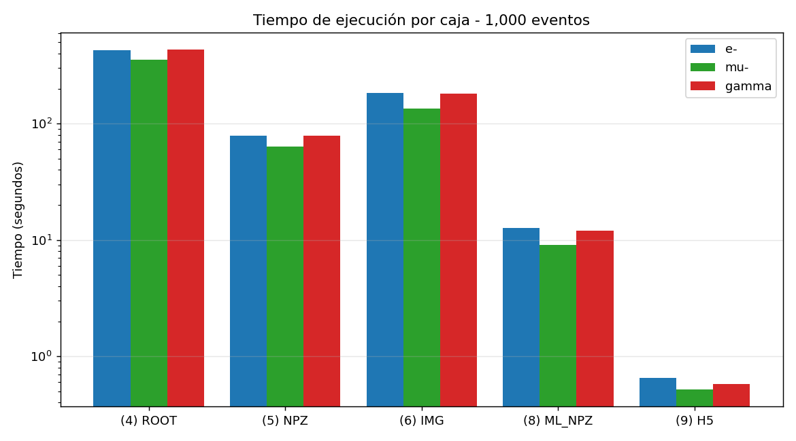
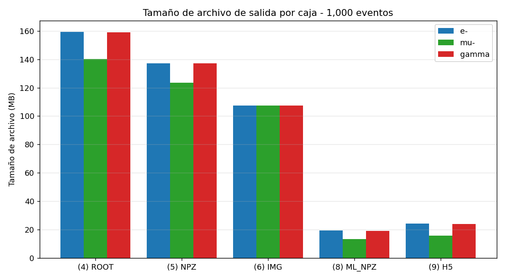
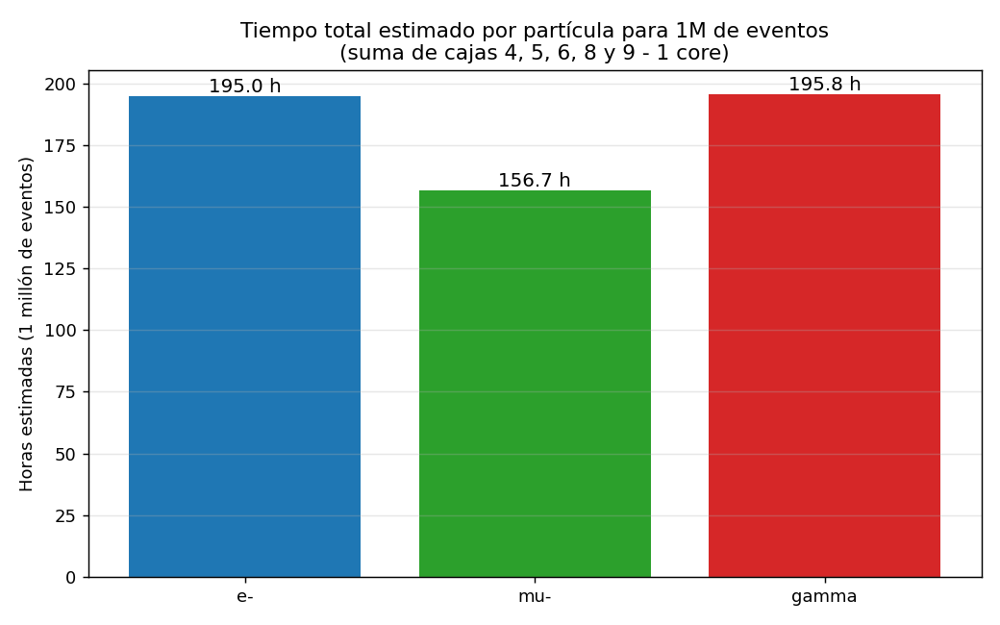
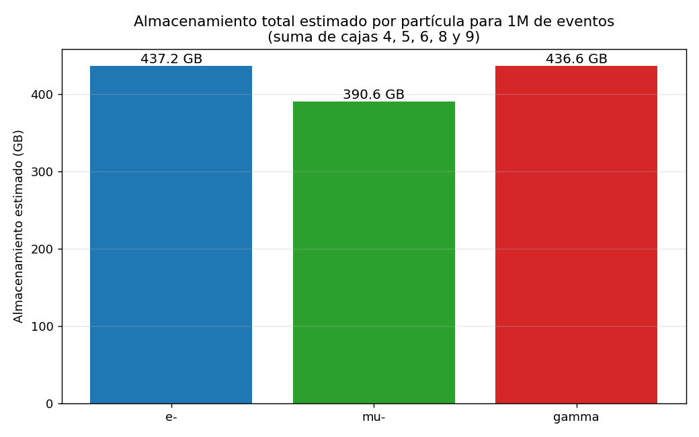

# Ejercicio sobre aproximado de capacidades requeridas

> Análisis de tiempos de procesamiento y consumo de almacenamiento para las cajas de procesamiento **4, 5, 6, 8 y 9** del pipeline WCSim, ejecutadas con **1,000 eventos por partícula** (e⁻, μ⁻, γ) y proyectadas a **1,000,000 de eventos**.

---

## 1. Hardware de la máquina utilizada

Las pruebas se ejecutaron sobre una MacBook Pro con chip **Apple M4 Pro**.

| Característica | Valor |
|---|---|
| Modelo | MacBook Pro |
| Procesador | Apple M4 Pro |
| Núcleos | **12 cores** (8 Performance + 4 Efficiency) |
| Memoria RAM | **24 GB** |
| Almacenamiento total | **460 GB** (SSD APFS) |
| Almacenamiento disponible | **152 GB** |
| Sistema operativo | macOS 26.4.1 (build 25E253) |
| Runtime de contenedores | **OrbStack** (Docker engine v29.4.0) |

> **Nota arquitectónica:** la imagen `manu33/wcsim:1.2` es `linux/amd64`; en Apple Silicon (arquitectura `arm64`) se ejecuta vía emulación Rosetta/QEMU que provee OrbStack.

Salida resumida del comando de inspección:

```shell
$ system_profiler SPHardwareDataType
...
  Chip: Apple M4 Pro
  Total Number of Cores: 12 (8 Performance and 4 Efficiency)
  Memory: 24 GB

$ df -h /
/dev/disk3s1s1   460Gi    12Gi   152Gi     8%   /
```

---

## 2. Preparación del ambiente y contenedor

El contenedor **WCSim** se basa en la imagen [manu33/wcsim:1.2](https://hub.docker.com/r/manu33/wcsim) y se ejecuta con un único volumen montado sobre `data/` del repositorio para mantener todos los artefactos generados (MAC, ROOT, NPZ, IMG, ML_NPZ, H5) dentro de la estructura del proyecto.

```bash
docker run \
  -v "<ruta-al-repo>/data":/home/neutrino/data \
  -d -it --name=WCSim manu33/wcsim:1.2
```

Verificación:

```bash
$ docker ps --filter name=WCSim
CONTAINER ID   IMAGE              COMMAND   STATUS         NAMES
ebbf9c9afb38   manu33/wcsim:1.2   "bash"    Up 2 seconds   WCSim

$ docker exec WCSim ls /home/neutrino/data
1_MAC  2_ROOT  3_Analisis_NPZ  4_Imagen_NPZ  5_ML_NPZ  6_HD5  Geometries
```

### 2.1 Generación de los archivos MAC (1,000 eventos)

Se duplicaron los `config_*.json` ajustando `simulations: "1000"`:

- [wcs_MCA_e-__0_500_MeV.mac](mac/wcs_MCA_e-__0_500_MeV.mac)
- [wcs_MCA_gamma__0_500_MeV.mac](mac/wcs_MCA_gamma__0_500_MeV.mac)
- [wcs_MCA_mu-__0_500_MeV.mac](mac/wcs_MCA_mu-__0_500_MeV.mac)

```jsonc
// Crear_MAC/config_e_1000.json, config_mu_1000.json y config_gamma_1000.json
{ "particle_1": { "name": "[e-,gamma-,mu-]",    "specification": "MCA",
                  "energy": { "MeV": "500" }, "simulations": "1000" } }
```

Comandos (ejecutados desde `Crear_MAC/`):

```bash
python3 mac_files_config.py --config_json config_e_1000.json     -d ../data/1_MAC/VaryE/e-    -i 1
python3 mac_files_config.py --config_json config_mu_1000.json    -d ../data/1_MAC/VaryE/mu-   -i 1
python3 mac_files_config.py --config_json config_gamma_1000.json -d ../data/1_MAC/VaryE/gamma -i 1
```

### 2.2 Script de medición

Para garantizar mediciones reproducibles se creó un script [bench.sh](scripts/bench.sh) que ejecuta cada caja y registra `(partícula, caja, segundos, bytes_salida)` en [results.csv](output/results.csv).

```bash
#!/bin/zsh
PART="$1"; BOX="$2"; OUTFILE="$3"; shift 3
[[ "$1" == "--" ]] && shift
START=$(python3 -c 'import time; print(time.time())')
"$@"
END=$(python3 -c 'import time; print(time.time())')
SECS=$(python3 -c "print(f'{$END - $START:.3f}')")
BYTES=$(stat -f%z "$OUTFILE" 2>/dev/null || echo 0)
echo "$PART,$BOX,$SECS,$BYTES" >> results.csv
```

---

## 3. Ejecución de las cajas y mediciones

Cada caja se ejecutó **una vez por partícula** (e⁻, μ⁻, γ), con 1,000 eventos a **500 MeV**. Las mediciones provienen del archivo [results.csv](output/results.csv).

``` csv
particle,box,seconds,bytes
e-,4_ROOT,426.289,167096274
mu-,4_ROOT,355.911,146888825
gamma,4_ROOT,432.121,166873526
e-,5_NPZ,78.696,143945380
mu-,5_NPZ,63.513,129400435
gamma,5_NPZ,78.302,143824572
e-,6_IMG,183.909,112640128
mu-,6_IMG,135.145,112640128
gamma,6_IMG,182.112,112640128
e-,8_MLNPZ,12.633,20359864
mu-,8_MLNPZ,9.035,13998397
gamma,8_MLNPZ,11.944,20205852
e-,9_H5,0.648,25381204
mu-,9_H5,0.519,16432360
gamma,9_H5,0.581,25234448
```

### 3.1 Caja (4)  Creación de archivos ROOT (`WCSim`)

Comando ejemplo (partícula e⁻):

```bash
docker exec WCSim bash -c "cd /home/neutrino/software; source run.sh; \
  cd \$SOFTWARE/WCSim_build; \
  ./WCSim /home/neutrino/data/1_MAC/VaryE/e-/wcs_MCA_e-__0_500_MeV.mac; \
  mv /home/neutrino/software/WCSim_build/wcs_MCA_e-__0_500_MeV.root \
     /home/neutrino/data/2_ROOT/VaryE/e-/wcs_MCA_e-__0_500_MeV.root"
```

| Partícula | Tiempo (s) | Bytes       | MB     |
|-----------|-----------:|------------:|-------:|
| e⁻        | **426.289** | 167,096,274 | 159.36 |
| μ⁻        | **355.911** | 146,888,825 | 140.08 |
| γ         | **432.121** | 166,873,526 | 159.14 |

### 3.2 Caja (5)  Conversión ROOT → NPZ (`event_dump.py`)

```bash
docker exec WCSim bash -c "cd /home/neutrino/software; source run.sh; \
  cd /home/WatChMal/DataTools; \
  python3 event_dump.py \
    /home/neutrino/data/2_ROOT/VaryE/<P>/wcs_MCA_<P>__0_500_MeV.root \
    -d /home/neutrino/data/3_Analisis_NPZ/VaryE/<P>"
```

| Partícula | Tiempo (s) | Bytes       | MB     |
|-----------|-----------:|------------:|-------:|
| e⁻        | **78.696** | 143,945,380 | 137.28 |
| μ⁻        | **63.513** | 129,400,435 | 123.41 |
| γ         | **78.302** | 143,824,572 | 137.16 |

### 3.3 Caja (6)  Conversión NPZ → Imagen (`npz_to_image.py`)

Script ejecutado en mac (Python miniconda):

```bash
python npz_to_image.py \
  -m data/Geometries/IWCD_geometry_mPMT.npy \
  -f data/3_Analisis_NPZ/VaryE/<P>/wcs_MCA_<P>__0_500_MeV.npz
```

| Partícula | Tiempo (s) | Bytes       | MB     |
|-----------|-----------:|------------:|-------:|
| e⁻        | **183.909** | 112,640,128 | 107.42 |
| μ⁻        | **135.145** | 112,640,128 | 107.42 |
| γ         | **182.112** | 112,640,128 | 107.42 |

### 3.4 Caja (8)  Conversión ROOT → ML_NPZ (`event_dump_barrel.py`)

```bash
docker exec WCSim bash -c "cd /home/neutrino/software; source run.sh; \
  cd /home/WatChMal/DataTools; \
  python3 event_dump_barrel.py /home/neutrino/data/2_ROOT/VaryE/<P>/<file>.root && \
  mv /home/neutrino/data/2_ROOT/VaryE/<P>/<file>.npz \
     /home/neutrino/data/5_ML_NPZ/VaryE/<P>/<file>.npz"
```

| Partícula | Tiempo (s) | Bytes      | MB    |
|-----------|-----------:|-----------:|------:|
| e⁻        | **12.633** | 20,359,864 | 19.42 |
| μ⁻        | **9.035**  | 13,998,397 | 13.35 |
| γ         | **11.944** | 20,205,852 | 19.27 |

### 3.5 Caja (9)  Conversión NPZ → HDF5 (`np_to_digihit_array_hdf5_FJOL.py`)

```bash
python np_to_digihit_array_hdf5_FJOL.py \
  data/3_Analisis_NPZ/VaryE/<P>/<file>.npz \
  -o data/6_HD5/VaryE/<P>/<file>.h5
```

| Partícula | Tiempo (s) | Bytes      | MB    |
|-----------|-----------:|-----------:|------:|
| e⁻        | **0.648**  | 25,381,204 | 24.21 |
| μ⁻        | **0.519**  | 16,432,360 | 15.67 |
| γ         | **0.581**  | 25,234,448 | 24.07 |

---

## 4. Visualizaciones
- [make_charts.py](scripts/make_charts.py) genera las siguientes visualizaciones a partir de [results.csv](output/results.csv):

### 4.1 Tiempo por caja (escala log)



### 4.2 Tamaño de archivo de salida por caja



### 4.3 Estimaciones para 1,000,000 de eventos por partícula





---

## 5. Estimación para 1M de eventos

Las mediciones se realizaron sobre **1,000 eventos**, por lo que para proyectar a **1,000,000** se aplica un factor de escala lineal de **× 1,000**.

> **Conversiones aplicadas**
> - `1 GB = 1,073,741,824 B` (binario)
> - `1 hora = 3,600 s`, `1 día = 86,400 s`

### 5.1 Resumen consolidado (1k eventos medidos)

| Partícula | Tiempo total (s) | Tamaño total (MB) |
|-----------|----------------:|------------------:|
| e⁻        | 702.18 | 447.69 |
| μ⁻        | 564.12 | 399.93 |
| γ         | 705.06 | 446.96 |
| **Suma**  | **1,971.36** | **1,294.58** |

### 5.2 Capacidades requeridas por partícula (1M eventos)

| Partícula | Tiempo total estimado | Almacenamiento total estimado |
|-----------|----------------------:|------------------------------:|
| **e⁻**    | **195.05 horas** (≈ 8.13 días) | **437.18 GB** |
| **μ⁻**    | **156.70 horas** (≈ 6.53 días) | **390.56 GB** |
| **γ**     | **195.85 horas** (≈ 8.16 días) | **436.58 GB** |

### 5.3 Capacidades totales para las tres partículas (1M cada una)

| Métrica | Valor estimado |
|---------|----------------|
| **Tiempo total de procesamiento** | **547.60 horas** ≈ **22.82 días** (con 1 core) |
| **Almacenamiento total**          | **1.23 TB** (≈ 1,264 GB) |

### 5.4 Tabla detallada por caja (proyección 1M)

| Partícula | Caja | Tiempo 1k (s) | Tiempo 1M (h) | Tamaño 1k (MB) | Tamaño 1M (GB) |
|-----------|------|--------------:|---------------:|---------------:|---------------:|
| e⁻ | (4) ROOT    | 426.289 | 118.41 | 159.36 | 155.62 |
| e⁻ | (5) NPZ     |  78.696 |  21.86 | 137.28 | 134.06 |
| e⁻ | (6) IMG     | 183.909 |  51.09 | 107.42 | 104.90 |
| e⁻ | (8) ML_NPZ  |  12.633 |   3.51 |  19.42 |  18.96 |
| e⁻ | (9) H5      |   0.648 |   0.18 |  24.21 |  23.64 |
| μ⁻ | (4) ROOT    | 355.911 |  98.86 | 140.08 | 136.80 |
| μ⁻ | (5) NPZ     |  63.513 |  17.64 | 123.41 | 120.51 |
| μ⁻ | (6) IMG     | 135.145 |  37.54 | 107.42 | 104.90 |
| μ⁻ | (8) ML_NPZ  |   9.035 |   2.51 |  13.35 |  13.04 |
| μ⁻ | (9) H5      |   0.519 |   0.14 |  15.67 |  15.30 |
| γ  | (4) ROOT    | 432.121 | 120.03 | 159.14 | 155.41 |
| γ  | (5) NPZ     |  78.302 |  21.75 | 137.16 | 133.95 |
| γ  | (6) IMG     | 182.112 |  50.59 | 107.42 | 104.90 |
| γ  | (8) ML_NPZ  |  11.944 |   3.32 |  19.27 |  18.82 |
| γ  | (9) H5      |   0.581 |   0.16 |  24.07 |  23.50 |

### 5.5 Observaciones

- La **caja (4) WCSim** domina por completo el costo de CPU: aporta ≈ **62 %** del tiempo total. Cualquier estrategia de aceleración (paralelismo, supercómputo) debe enfocarse aquí primero.
- La **caja (6) NPZ → Imagen** es la segunda más costosa, ejecutada en host con un solo core (Python puro / NumPy).
- Las **cajas (8) ML_NPZ** y **(9) H5** son prácticamente despreciables: < 1 % combinado.
- Aunque μ⁻ produce los mismos 1,000 eventos, **toma menos tiempo y ocupa menos espacio** que e⁻ y γ porque el muón a 500 MeV genera anillos Cherenkov más limpios y compactos[1] (menos hits por evento).
  -  [1]El muón a 500 MeV está por debajo del umbral de producción de pares, por lo que no genera cascadas electromagnéticas como el electrón o el fotón, resultando en eventos más simples.
- El cuello de botella de **almacenamiento** son las cajas (4) ROOT y (5) NPZ; juntas representan ≈ **75 %** del espacio final.
- Con **22.8 días** de procesamiento secuencial en un solo core, queda claramente justificado el uso de **supercómputo** o paralelismo de varias instancias del contenedor (cada MAC es independiente).
