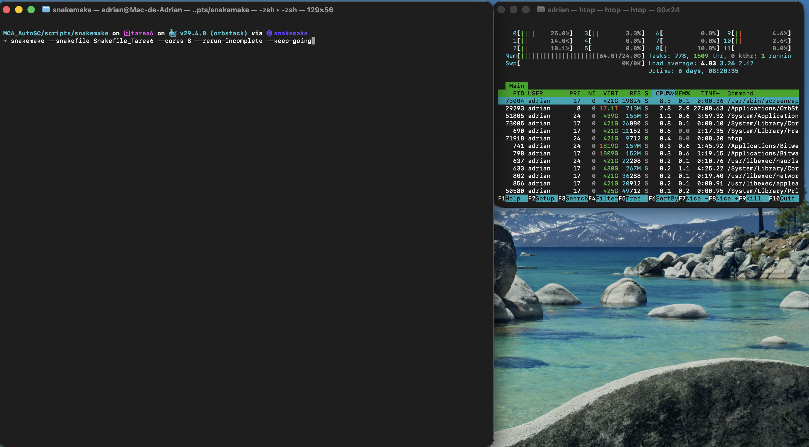
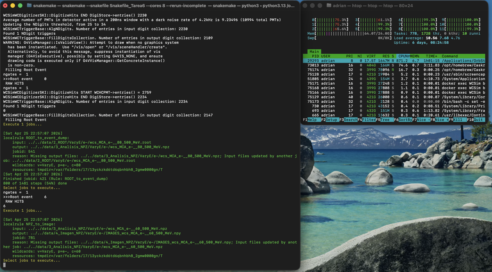
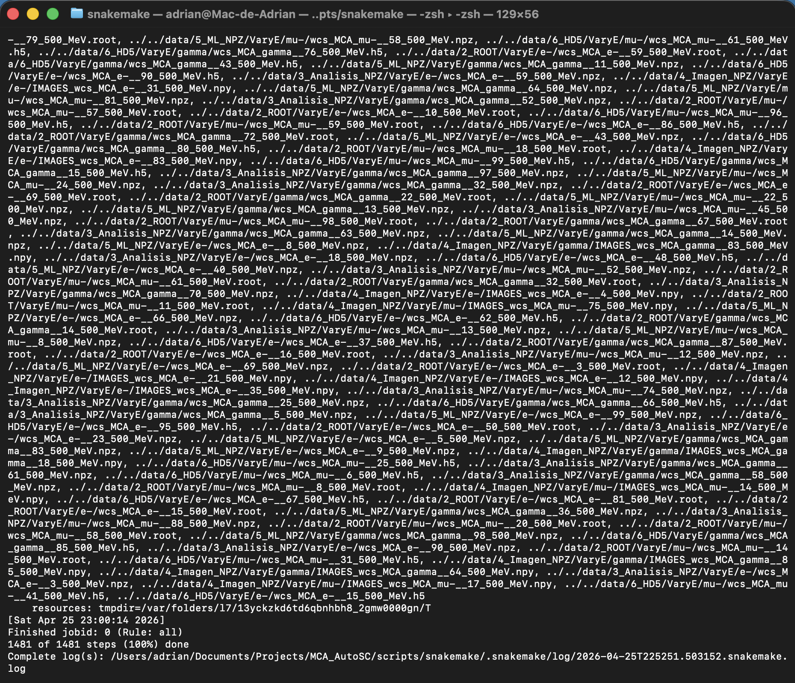

# Laboratorio de automatización

> Reto: generar **100 archivos `.mac` por partícula** (e⁻, μ⁻, γ) usando el grupo
> **VaryE** (10 eventos por archivo) y **automatizar las cajas 4, 5, 6, 8 y 9**
> con Snakemake, basándose en `Snakefile_group_docker`. Se esperan
> **1,500 archivos producidos** (5 cajas x 3 partículas x 100 corridas) más
> los 300 `.mac` de entrada.


## 1. Hardware y entorno

| Item | Valor |
|---|---|
| Modelo | MacBook Pro (2024) |
| Chip | Apple M4 Pro (8P + 4E = 12 cores) |
| RAM | 24 GB |
| Disco | 460 GB / ~150 GB libres |
| OS | macOS 26.4.1 |
| Runtime | OrbStack  Docker Engine 29.4.0 |
| Imagen WCSim | `manu33/wcsim:1.2` (linux/amd64 → emulada en arm64) |
| Snakemake | `9.19.0` |


## 2. Cambios realizados

1. **Generación de 300 `.mac`** (100 por partícula) con `mac_files_config.py` y los `config_*.json` ya existentes (`simulations: "10"`, energía 500 MeV).
2. **Adaptación** `Snakefile_group_docker` a `Snakefile_Tarea6`:
   - Un único contenedor `WCSim`.
   - `docker exec` sin `sudo` ni `-it` (Snakemake corre no-interactivo en macOS).
   - Se añade la regla **`NPZ_to_H5_digihit`** (caja 9).
   - Las cajas 6 y 9 corren en la Mac con Python de miniconda.
   - Variables de entorno para contenedor y Python host, con valores por defecto.
3. **Validación** con 1 partícula y 2 archivos (e⁻ corridas 0 y 1)  y luego con
   1 corrida de μ⁻ y 1 de γ  antes de lanzar la corrida masiva.


## 3. Generación de los 300 archivos `.mac`

```bash
cd Crear_MAC
python3 mac_files_config.py --config_json config_e.json     -d ../data/1_MAC/VaryE/e-    -i 100
python3 mac_files_config.py --config_json config_mu.json    -d ../data/1_MAC/VaryE/mu-   -i 100
python3 mac_files_config.py --config_json config_gamma.json -d ../data/1_MAC/VaryE/gamma -i 100
```

## 4. Snakefile final

- [Snakefile_Tarea6](Snakefile_Tarea6)

Diferencias clave frente a `Snakefile_group_docker`:

| Aspecto | `Snakefile_group_docker` | `Snakefile_Tarea6` |
|---|---|---|
| `range(CORRIDA)` | `range(2)` | `range(0, 100)` |
| `sudo docker exec -it` | sí | **no** (no interactivo) |
| Mount path | `/home/neutrino/in_out_demos` | `/home/neutrino/data` |
| Carpetas paso 5 / 8 / 9 | `3_NPZ_event_dump`, `5_NPZ_event_dump_barrel`, *(no tenía paso 9)* | `3_Analisis_NPZ`, `5_ML_NPZ`, **`6_HD5` (regla `NPZ_to_H5_digihit` añadida)** |
| Python | `python3` (PATH del entorno) | Variable de entorno `WCSIM_HOST_PY` para el Python del cliente |
| Contenedor | Nombre del contenedor fijo | Variable de entorno `WCSIM_CONTAINER` para el contenedor |

Comando real con que se ejecutó la corrida completa:

```bash
conda activate snakemake
cd scripts/snakemake
snakemake --snakefile Snakefile_Tarea6 --cores 8 --rerun-incomplete --keep-going
```

Resultado: **1481/1481 jobs OK**, **7 min 21 s** end-to-end.


## 5. Evidencias de ejecución
### 5.1 Inicio



### 5.2 En Ejecución



### 5.3 Corrida completa finalización
 `1481 of 1481 steps (100%) done` en en lugar de 1500 porque se ejecutó una prueba previa con 1 corrida de cada partícula que ya estaban hechas previas al lanzar la corrida masiva.


### 5.4 Logs de snakemake




## 6. Resultados finales

Conteo verificado en disco al cierre de la corrida (→ `find ... | wc -l`
de cada carpeta):

| Carpeta | e⁻ | μ⁻ | γ | **Total** | Tamaño |
|---|---:|---:|---:|---:|---:|
| `data/1_MAC/VaryE`          | 100 | 100 | 100 | **300** | 1.2 MB |
| `data/2_ROOT/VaryE`         | 100 | 100 | 100 | **300** | 475 MB |
| `data/3_Analisis_NPZ/VaryE` | 100 | 100 | 100 | **300** | 403 MB |
| `data/4_Imagen_NPZ/VaryE`   | 100 | 100 | 100 | **300** | 323 MB |
| `data/5_ML_NPZ/VaryE`       | 100 | 100 | 100 | **300** | 53 MB  |
| `data/6_HD5/VaryE`          | 100 | 100 | 100 | **300** | 66 MB  |
| **Total archivos producidos** |  |  |  | **1,800** | **~1.3 GB** |

**100 archivos por partícula x 5 cajas + 100 MAC = 1,500 archivos automatizados por Snakemake; los 300 MAC de entrada se cuentan aparte.**

### 6.1 Métricas de ejecución

| Métrica | Valor |
|---|---|
| Inicio | `[Sábado 25 de Abril de 2026 a las 22:52:53]` |
| Fin    | `[Sábado 25 de Abril de 2026 a las 23:00:14]` |
| **Duración total** | **7 min 21 s (441 s)** |
| Cores  | 8 (de 12 disponibles) |
| Throughput | ~3.4 jobs/s (paralelizando entre corridas) |
| Fallos | 0 |

## 7. Listado de archivos producidos

- [listado_archivos.txt](output/listado_archivos.txt) 

Generado con:

```bash
find data/1_MAC/VaryE data/2_ROOT/VaryE data/3_Analisis_NPZ/VaryE \
     data/4_Imagen_NPZ/VaryE data/5_ML_NPZ/VaryE data/6_HD5/VaryE \
     -type f -not -name 'Ignorar.odt' -not -name '.DS_Store' | sort \
     > listado_archivos.txt
```

